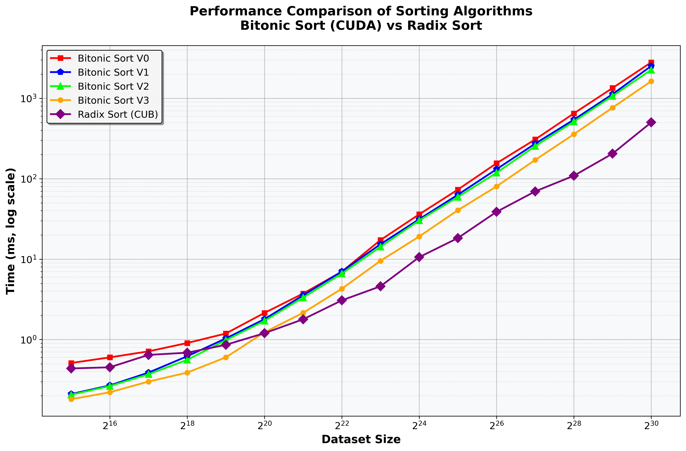

# Parallel and Distributed Systems - Exercise 3: CUDA Bitonic Sort


This repository contains multiple CUDA implementations of **Bitonic Sort** with various optimizations, along with a **Radix Sort** implementation for performance comparison. The project demonstrates GPU-accelerated sorting techniques, highlights optimization trade-offs, and analyzes performance using CUDA events and the NVIDIA Nsight profiler.

---

## 📌 Table of Contents
1. [Introduction](#-introduction)
2. [Setup and Requirements](#%EF%B8%8F-setup-and-requirements)
3. [Compilation and Usage](#-compilation-and-usage)
4. [Directory Structure](#-directory-structure)
5. [Algorithm Versions](#-algorithm-versions)
6. [Performance Metrics](#-performance-metrics)
7. [Debugging and Verification](#-debugging-and-verification)
8. [Makefile Targets](#-makefile-targets)
9. [Cleanup](#-cleanup)

---

## 🚀 Introduction

This project implements four optimized versions of **Bitonic Sort** and a **Radix Sort** on NVIDIA GPUs using CUDA:

| Algorithm           | Optimizations Applied |
|--------------------|----------------------|
| **Bitonic Sort V0** | Baseline implementation using global memory |
| **Bitonic Sort V1** | Kernel fusion for intra-block communication |
| **Bitonic Sort V2** | Shared memory for efficient intra-block operations |
| **Bitonic Sort V3** | Reduced thread spawn, warp shuffling, pinned memory |
| **Radix Sort** | Uses CUDA CUB library for comparison |

---

## ⚙️ Setup and Requirements

✅ **Hardware:**
- NVIDIA GPU with Compute Capability **≥ 3.5**

✅ **Software:**
- **CUDA Toolkit** **≥ 11.0**
- **NVCC Compiler** (part of CUDA Toolkit)
- **Make** build system

✅ **Tested On:**
- NVIDIA **T4** (Compute 7.5)
- NVIDIA **Tesla P100** (Compute 6.0)
- NVIDIA **Ampere A100** (Compute 8.0)

---

## 🔨 Compilation and Usage

### 📌 Compilation
Use the provided **Makefile** to build all implementations:
```bash
make all
```

To build specific versions:
```bash
make bitonic v=[0|1|2|3]  # Build a specific Bitonic Sort version
make radix                # Build Radix Sort
```

✅ **Executables are stored in the `bin/` directory:**
- `bitonic_v0`, `bitonic_v1`, `bitonic_v2`, `bitonic_v3` (Bitonic Sort versions)
- `radix_sort` (Radix Sort)

### 📌 Running the Program
Run with `q` specifying **log₂(number of elements)**:
```bash
make run v=[0|1|2|3|radix] q=<value>
```

Example (**Sort 2²⁰ elements using Bitonic Sort V2**):
```bash
make run v=2 q=20
```

---

## 📂 Directory Structure

```
📦 Project Root
 ┣ 📂 src/         # Source code for Bitonic and Radix Sort implementations
 ┣ 📂 bin/         # Compiled executables
 ┣ 📂 results/     # Performance metrics and verification results
 ┣ 📂 docs/        # Documentation and report files
 ┣ 📜 Makefile     # Build system
```

---

## 🔍 Algorithm Versions

### **🟢 Bitonic Sort V0 (Baseline)**
- Uses **global memory** for all operations.
- Simple **one-thread-per-element** approach.
- Serves as a **performance baseline** for optimizations.

### **🟡 Bitonic Sort V1 (Kernel Fusion)**
- **Fuses multiple sorting steps** into a single kernel launch.
- **Minimizes global synchronization** overhead.
- Memory access pattern is still **global memory dependent**.
- **Performance Improvement**: Achieves a 30% speedup over V0.

### **🟠 Bitonic Sort V2 (Shared Memory Optimization)**
- Utilizes **fast shared memory** for intra-block operations.
- Reduces **global memory transactions**, improving performance.
- **Performance Improvement**: Achieves a 20% speedup over V1.

### **🔴 Bitonic Sort V3 (Advanced Optimizations)**
- **Minimized thread spawn** in main sorting kernel.
- **Optimized warp shuffle operations** to reduce global synchronization.
- **Pinned Memory Usage** for efficient host-device transfers.
- **Performance Improvement**: Achieves a 20% speedup over V2.

### **🔵 Radix Sort (Reference Implementation)**
- Uses **CUB library** for Radix Sort.
- Included for **performance comparison** with Bitonic Sort.

---

## 📊 Performance Metrics

Performance is measured using **CUDA events (`cudaEventElapsedTime`)**. Each test runs multiple times to ensure accurate measurement. 

🔍 **Profiling Tools Used:**
- **NVIDIA Nsight Profiler** for kernel analysis
- **CUDA event timers** for execution time measurement

📈 **Performance Graph (A100 GPU):**


---

## 🛠 Debugging and Verification

To enable/disable debugging and verification options, modify the following `#define` statements in the beginning of each source file:
```c
 #define DEBUG  // Enables detailed output for debugging
 #define VERIFY_SEQUENTIAL  // Enables comparison with sequential CPU sort (for verification)
```

---

## 📝 Makefile Targets

| Command | Description |
|---------|-------------|
| `make all` | Builds all Bitonic Sort versions and Radix Sort |
| `make bitonic v=[0\|1\|2\|3]` | Builds a specific Bitonic Sort version |
| `make radix` | Builds Radix Sort |
| `make run v=[0\|1\|2\|3\|radix] q=<value>` | Runs the specified sorting algorithm with `2^q` elements |
| `make clean` | Removes all compiled binaries and object files |
| `make help` | Displays help message |


## 🗑 Cleanup
To remove all compiled executables:
```bash
make clean
```
