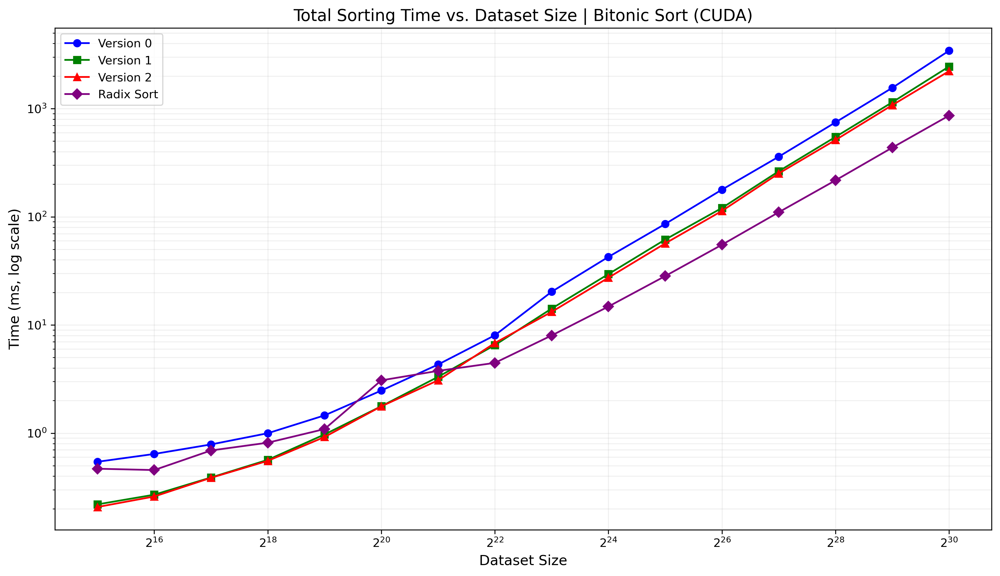

# Parallel and Distributed Systems - Exercise 3: CUDA Bitonic Sort

This repository contains multiple CUDA implementations of Bitonic Sort with different optimizations, plus a Radix Sort implementation for performance comparison. The project demonstrates GPU-accelerated sorting strategies and their optimization trade-offs.

## Table of Contents
1.  [Introduction](#introduction)
2.  [Setup and Requirements](#setup-and-requirements)
3.  [Compilation and Usage](#compilation-and-usage)
4.  [Directory Structure](#directory-structure)
5.  [Algorithm Versions](#algorithm-versions)
6.  [Performance Metrics](#performance-metrics)
7.  [Verification](#verification)
8.  [Makefile Targets](#makefile-targets)
9.  [Cleanup](#cleanup)

## Introduction

This project implements three optimized versions of **Bitonic Sort** and a **Radix Sort** on NVIDIA GPUs using CUDA:

- **Bitonic Sort V0**: Baseline implementation with global memory operations
- **Bitonic Sort V1**: Optimized with kernel fusion for intra-block communication
- **Bitonic Sort V2**: Enhanced with shared memory for intra-block communication
- **Bitonic Sort V3**: Further optimized with pinned memory and warp shuffling
- **Radix Sort**: Reference implementation using CUDA Thrust library

## Setup and Requirements

- **NVIDIA GPU** with Compute Capability >= 3.5 
- **Tested On**: 
  - T4 (Compute 7.5)
  - Tesla P100 (Compute 6.0)
  - Ampere A100 (Compute 8.0)
- **CUDA Toolkit** ≥ 11.0
- **Make** build system
- **Compiler**: NVCC (part of CUDA Toolkit)

## Compilation and Usage

### Compilation

Use the provided `Makefile` to build all implementations:
```bash
make all
```

Individual targets:
```bash
make bitonic v=[0|1|2]  # Build specific bitonic version
make radix              # Build radix sort
```

Generated executables:

- `bitonic_v0`, `bitonic_v1`, `bitonic_v2`: Bitonic Sort versions
- `radix`: Radix Sort

### Running the Program

Run with `q` specifying log2(number of elements):
```bash
make run v=[0|1|2|radix] q=<value>
```

Example (sort 2^20 elements with Bitonic Sort V2):
```bash
make run v=2 q=20
```

## Directory Structure

- `src/`: Source code for Bitonic and Radix Sort implementations
- `Makefile`: Build system for compiling the code
- `results/`: Performance metrics and verification results
- `docs/`: Documentation and report files

## Algorithm Versions

### Bitonic Sort V0
- **Global Memory**: Baseline implementation using global memory operations
- **Simple Structure**: One thread per element, direct global memory access
- **Performance Baseline**: Serves as reference for optimization improvements

### Bitonic Sort V1
- **Kernel Fusion**: Combines multiple sorting steps into single kernel launches
- **Reduced Synchronization**: Minimizes global synchronization points
- **Memory Access**: Still primarily uses global memory operations

### Bitonic Sort V2
- **Shared Memory**: Utilizes fast shared memory for intra-block operations

### Radix Sort

- **CUDA Thrust**: Uses Thrust library for Radix Sort implementation
- **Performance Comparison**: Compares Bitonic and Radix Sort performance

## Performance Metrics

Performance is measured by the execution time of the sorting kernel, as reported by CUDA events (`cudaEventElapsedTime`). The reported time is the average of multiple runs (typically 10) to reduce measurement noise. NVIDIA Nsight profiler is used to analyze kernel performance and identify bottlenecks. See the profiling files in `results/` for detailed metrics.



## Debugging and Verification

To enable debugging or sequential verification, uncomment the relevant lines in the beginning of each source file:

```c
// #define DEBUG // Enables detailed output for debugging
// #define VERIFY_SEQUENTIAL // Enables comparison with sequential sorting
```

## Makefile Targets

The `Makefile` provides the following targets:

*   `all`: Builds all Bitonic Sort versions and Radix Sort.
*   `bitonic v=[0|1|2]`: Builds the specified Bitonic Sort version.
*   `radix`: Builds the Radix Sort.
*   `run v=[0|1|2|radix] q=<value>`: Runs the specified sorting algorithm with 2^q elements.
*   `clean`: Removes all generated executables and object files.
*   `help`: Displays this help message.

## Cleanup

Remove all generated executables:
```bash
make clean
```

